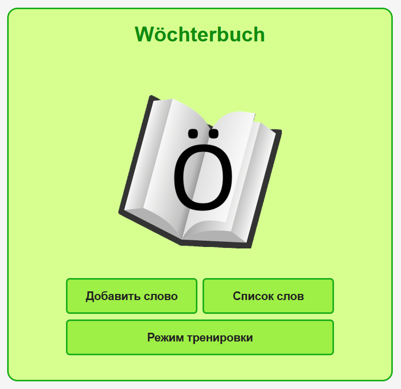

# Wöchterbuch

---
## Description

Möchten Sie die Artikeln für die Wöchter lernen? Dann diese Applikation ist für Sie!
Add words to a dictionary and train articles for them.



---

## Run the application

Start only backend with database:
```
docker-compose -f .\docker\docker-compose-backend.yml up -d
```

Start only frontend:
```
npm start
```

Start the app as a whole:
```
docker-compose -f .\docker\docker-compose-dev.yml up -d
```

To start GitLab CI pipeline, one needs to install a gitlab runner utility (follow instructions from GitLab), configure a runner and start it:
```
.\gitlab-runner.exe run
```
